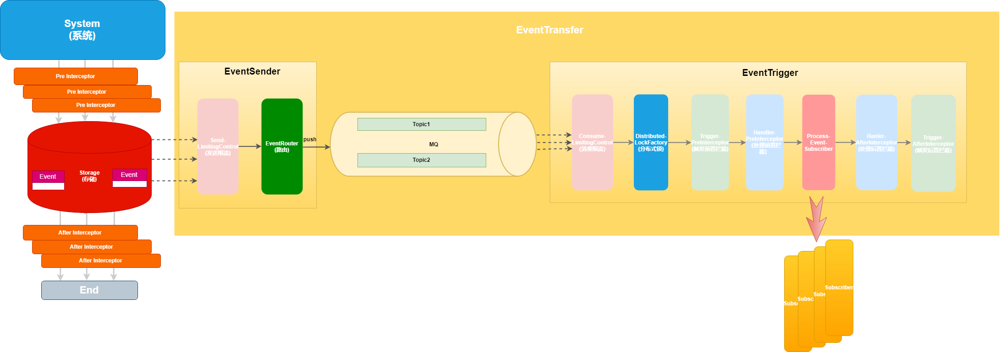

# EasyEvent

**Make Distributed Event Driven Easier!**

### 介绍

#### 什么是EasyEvent

`EasyEvent`是一款基于`Google Guava` 的`EventBus`为蓝本的分布式的,可扩展的,最终一致性的实时的`EventBus`解决方案。\
主要是解决`Google EventBus`的不支持持久化和分布式机器调度等的问题。

#### 功能特性

支持同步事件、异步事件、顺序事件/并行事件触发执行。\
支持事件异常补偿、预警等功能

#### 解决问题

1、解决使用事件驱动中的数据一致性问题

2、解决事件集中触发出现时,服务不稳定性问题

3、解决分布式事件追踪性问题

4、解决针对事件执行异常监控预警问题

5、解决DDD中的事件驱动问题

### 软件架构

`EasyEvent` 为了实现上述问题。抽象出几个核心的角色。通过`EventStorage` 进行存储,可以通过SPI的形式进行扩展实现。\
通过`EventTransfer`进行事件的分布式调度处理。也可通过自定义SPI实现。\
异步事件处理调度如下图所示：

#### 代码结构

- `easyevent-common`: 公共模块服务

- `easyevent-core`: 核心eventbus逻辑

- `easyevent-storage`: 存储服务
  - `easyevent-storage-api`: 存储服务API
  - `easyfile-storage-jdbc`: 基于jdbc的存储实现

- `easyevent-transfer`: 事件传输服务
  - `easyevent-transfer-api`: 事件传输协议
  - `easyevent-transfer-disruptor`: disruptor 作为事件传输的实现
  - `easyevent-transfer-rocketmq`: rocketmq 作为事件传输的实现
  - `easyevent-transfer-kafka`: kafka 作为事件传输的实现

- `easyevent-spring-boot-starter`: easyevent starter 包

- `easyfile-example`: 样例工程
  - `easyevent-example-disruptor`: 使用disruptor 作为传输调度层
  - `easyevent-example-rocketmq`: 使用rocketmq 作为传输调度层
  - `easyevent-example-rocketmq`: 使用kafka 作为传输调度层

### 快速开始

[快速开始](doc/QuickStart.md)

### 扩展性

[扩展](doc/Extend.md)