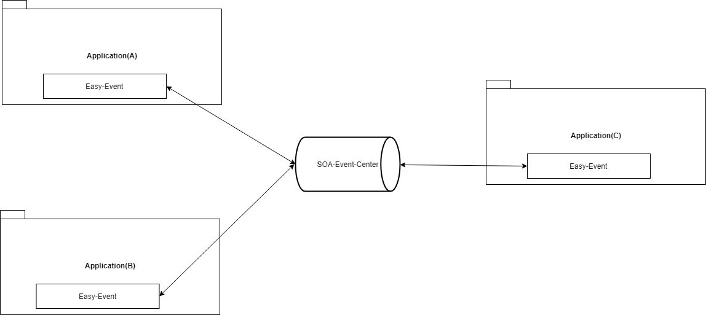

<div align=center></div>

<div align=center>

# EasyEvent

**Make Distributed Event Driven Easier**

[](LICENSE)
[](https://search.maven.org/search?q=g:com.openquartz%20a:easy-event)
[](https://github.com/openquartz/easy-event/actions)
[](https://github.com/openquartz/easy-event/pulls)

[English](README_en.md) | [中文简体](README.md)

</div>

---

## 📖 Introduction

`EasyEvent` is a distributed, reliable, and eventually consistent real-time event bus framework inspired by **Google Guava EventBus**.

It retains the simple and easy-to-use programming model of Guava EventBus while addressing its pain points such as **lack of persistence**, **inability to dispatch across machines**, and **lack of exception compensation mechanisms**. It is dedicated to providing a lightweight, high-performance event-driven solution for microservices architectures.

## ✨ Features

- **🛡️ High Reliability**
    - Adopts "Local Message Table + Eventual Consistency" pattern to ensure 100% event delivery.
    - Supports dual confirmation mechanism for publishers and consumers.

- **⚡ High Performance**
    - **Fire-and-Forget**: Supports non-blocking asynchronous dispatch mode to improve throughput in high-concurrency scenarios.
    - **Batch Insert**: Integrates Snowflake algorithm to support efficient JDBC batch event writing.

- **🔍 Distributed Tracing**
    - Built-in `TraceContext` supports cross-thread and cross-service full-link Trace ID propagation.
    - Perfectly adapts to log monitoring systems for quick problem localization in distributed environments.

- **🔌 Pluggable Architecture**
    - **Storage Layer**: Supports relational databases like JDBC (MySQL/PostgreSQL), easy to extend.
    - **Transfer Layer**: Supports multiple middlewares like Kafka, RocketMQ, Disruptor, RabbitMQ, switchable on demand.

- **⚖️ Flexible Isolation**
    - Supports event isolation based on Tags.
    - Independent thread pool management to prevent system avalanches caused by single business blocking.

- **🔄 Auto Compensation**
    - Built-in failure retry and compensation mechanism to intelligently handle event recovery in abnormal situations.

## 🏗️ Architecture

EasyEvent decouples the event lifecycle by abstracting `EventStorage` (Storage) and `EventTransfer` (Transfer), enabling flexible distributed scheduling.

**Single Node Process:**


**SOA/Distributed Process:**


## 🚀 Quick Start

### 1. Add Dependency (Maven)

Add core dependencies in `pom.xml` (taking Disruptor transfer layer as an example):

```xml
<properties>
    <easyevent.version>1.5.0-beta</easyevent.version>
</properties>

<dependency>
    <groupId>com.openquartz</groupId>
    <artifactId>easyevent-spring-boot-starter-parent</artifactId>
    <version>${easyevent.version}</version>
</dependency>
<dependency>
    <groupId>com.openquartz</groupId>
    <artifactId>easyevent-spring-boot-starter-disruptor</artifactId>
    <version>${easyevent.version}</version>
</dependency>
```

### 2. Define Event

```java
public class UserRegisteredEvent {
    private Long userId;
    private String username;

    public UserRegisteredEvent(Long userId, String username) {
        this.userId = userId;
        this.username = username;
    }
    // Getters and Setters...
}
```

### 3. Publish Event

Inject `EventBus` and post the event:

```java
@Service
public class UserService {
    @Autowired
    private EventBus eventBus;

    public void registerUser(User user) {
        // Business logic...
        // Post event
        eventBus.post(new UserRegisteredEvent(user.getId(), user.getName()));
    }
}
```

### 4. Subscribe Event

Implement event handler and add `@Subscribe` annotation:

```java
@Component
public class UserEventHandler {

    @Subscribe
    @AllowConcurrentEvents // Enable concurrent processing
    public void onUserRegistered(UserRegisteredEvent event) {
        System.out.println("User registered: " + event.getUsername());
    }
}
```

## 📊 Comparison

| Feature | EasyEvent | Google EventBus | Spring Cloud Bus | RocketMQ EventBridge |
|---|---|---|---|---|
| **Positioning** | Distributed, Persistent, Eventually Consistent | Single-machine In-memory | Config Refresh / Message Bus | Cloud Native Event Bridge |
| **Distributed** | ✅ Supported (Multi-machine/SOA) | ❌ Single-machine Only | ✅ Supported | ✅ Supported |
| **Persistence** | ✅ Local Message Table (High Reliability) | ❌ No | ❌ No | ✅ Depends on MQ |
| **Ops Cost** | ⭐ Low (DB + Any MQ) | ⭐ None | ⭐⭐ Low | ⭐⭐⭐ Medium |
| **Tracing** | ✅ Built-in Support | ❌ No | ❌ Needs Sleuth | ✅ Depends on Cloud Vendor |
| **Isolation** | ✅ Thread Pool/Tag Isolation | ❌ No | ❌ No | ❌ No |

## 🔗 Documentation

- [Quick Start Guide](doc/QuickStart.md)
- [Extension Guide](doc/Extend.md)

## 🤝 Contribution

Welcome to submit **Issue** and **Pull Request**! If you find this project helpful, please give us a ⭐️ **Star**!

## 📄 License

[Apache 2.0 License](LICENSE)

---

<div align="center">
    
[](https://star-history.com/#openquartz/easy-event&Date)

</div>
